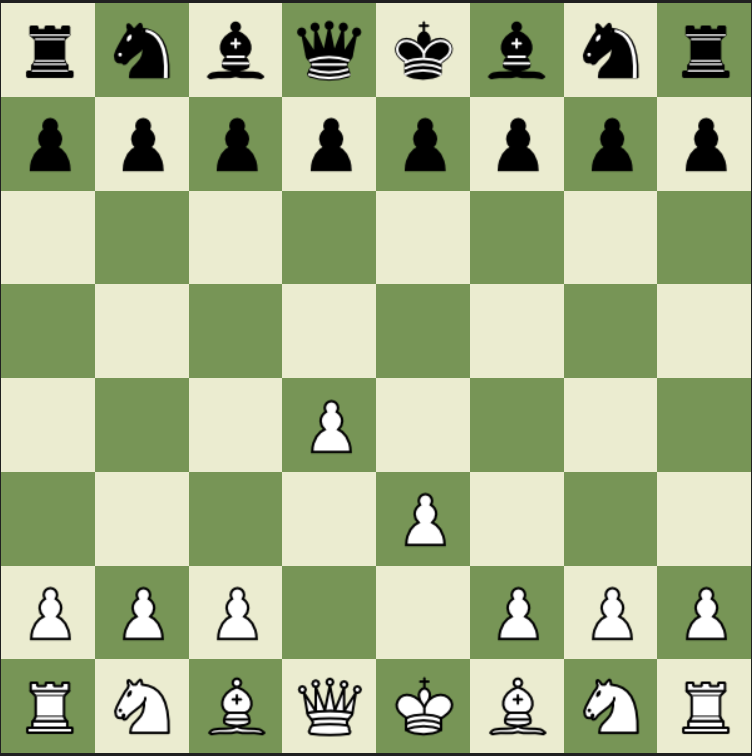

<!-- PROJECT LOGO -->
<br />
  <h1 align="center">REACT CHESS APP</h1>

  <p align="center">
    Chess application build with React and TypeScript, with design intend to look like it is from <a href="https://chess.com"><strong>Chess.com</strong></a>.
  </p>
  <br/>  <br/>

<!-- ABOUT THE PROJECT -->

<h1 align="center">About the app</h1>

<p align="center">
  
</p>

### Built With

- [React](https://reactjs.org/)
- [TypeScript](https://www.typescriptlang.org/)
- CSS

<!-- GETTING STARTED -->

## Getting Started

To get a local copy up and running follow these simple steps.

### Installation

1. Clone the repo
   ```sh
   git clone https://github.com/genadi53/react-chess.git
   ```
2. Install NPM packages
   ```sh
   npm install
   ```
3. Run the app
   ```sh
    npm start
   ```
   Open [http://localhost:3000](http://localhost:3000) to view it in the browser.
